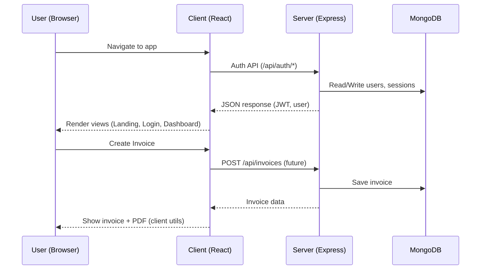
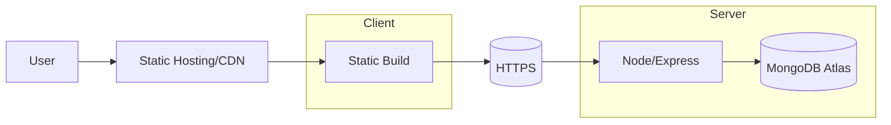

## Project Handoff

This document is a high‑signal overview of the stack, flows, environment variables, integrations, and a guided codebase walkthrough to help new contributors get productive quickly.

### Stack Overview
- Frontend: React 19 + Vite 7, React Router 7, Tailwind CSS 4, lucide-react, react-hot-toast
- Backend: Node.js (ESM) + Express 5, CORS, dotenv, bcryptjs, jsonwebtoken, multer
- Database: MongoDB via Mongoose (configured in `backend/config/database.js`)
- AI/External SDKs: `@google/genai` (see env section)
- Build & Dev:
  - Client scripts: `dev`, `build`, `preview`, `lint`
  - Server scripts: `dev` (nodemon), `start`

### High-level Flow (Mermaid)



### Deployment Architecture (Mermaid)



### Environment Variables

Backend (`backend/.env`):
- `PORT` (optional, default 8000)
- `MONGODB_URI` (MongoDB connection string)
- `JWT_SECRET` (JWT signing secret)
- `GOOGLE_API_KEY` (for `@google/genai` if used)

Frontend (`client/.env`):
- `VITE_API_BASE_URL` (Base URL for backend APIs)

Notes:
- The backend currently logs `Server is running at ${process.env.PORT}`; ensure `PORT` is set.
- CORS is configured with wildcard origin; lock it down in production.

### Integration Points

APIs exposed from backend:
- `GET /` health check
- `POST /api/auth/...` (see `backend/routes/authroutes.js`)

Planned/Typical endpoints (not fully present yet):
- `/api/invoices` for CRUD
- `/api/profile` for user profile updates

Third‑party:
- `@google/genai`—requires `GOOGLE_API_KEY`
- Multer for uploads (if file handling needed)

### Codebase Walkthrough

Repository root:
- `client/` React app
  - `src/pages/` routes: `LandingPage`, `Auth`, `Dashboard`, `Invoices`, `Profile`
  - `src/components/` shared UI and landing components
  - `src/context/AuthContext.jsx` (auth state, consumer of backend auth)
  - `src/utils/` helpers; `axiosInstance.js` expected to configure base URL and interceptors
  - `App.jsx` routes w/ `ProtectedRoute`
  - `index.css` Tailwind layer config
- `backend/` Express server
  - `index.js` server bootstrap, CORS, JSON body parser, routes registration
  - `config/database.js` (not opened here, but required by `connectDb()`)
  - `routes/authroutes.js` authentication routes (JWT, bcryptjs)

Backend server (`backend/index.js`) key points:
```start:37:/Users/mridulpandey/Developer/WebDevelopment/InvoiceGenerator/backend/index.js
import express from "express";
import cors from "cors";
import bcrypt from "bcryptjs";
import dotenv from "dotenv";
import connectDb from './config/database.js';
import authRouter   from './routes/authroutes.js'
const app = express();
dotenv.config();
app.use(
  cors({
    origin: "*",
    methods: ["GET", "POST", "PUT", "DELETE"],
    allowedHeaders: ["Content-Type", "Authorization"],
  })
);


// Middleware to parse JSON bodies
app.use(express.json());

const PORT = process.env.PORT || 8000;

app.get("/", (req, res) => {
  res.json({message : "Hello World"});
});

app.use("/api/auth" , authRouter)


connectDb().then(() => {
  app.listen(PORT, () => {
    console.log(`Server is running at ${process.env.PORT}`);
  });
});
```

Frontend app (`client/src/App.jsx`) sets up public and protected routes, with `ProtectedRoute` guarding dashboard and invoice pages.

### Local Development

Backend:
```bash
cd backend
cp .env.example .env # create and fill values
npm install
npm run dev
```

Frontend:
```bash
cd client
cp .env.example .env # create and fill VITE_API_BASE_URL
npm install
npm run dev
```

### Conventions
- ESM modules across repo
- React Router v7 route structure in `App.jsx`
- TailwindCSS for styling
- Keep secrets out of client (only VITE_ prefixed public values)


